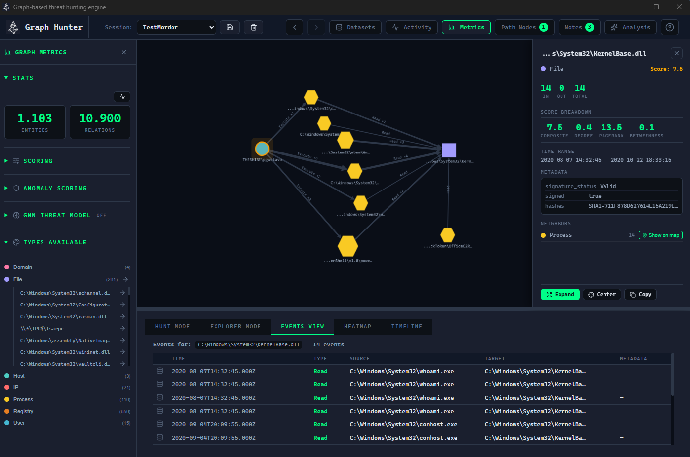
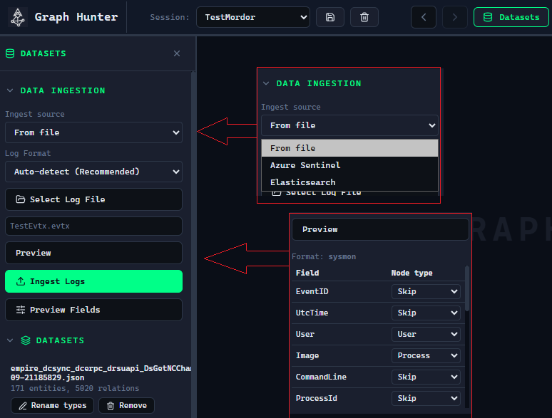
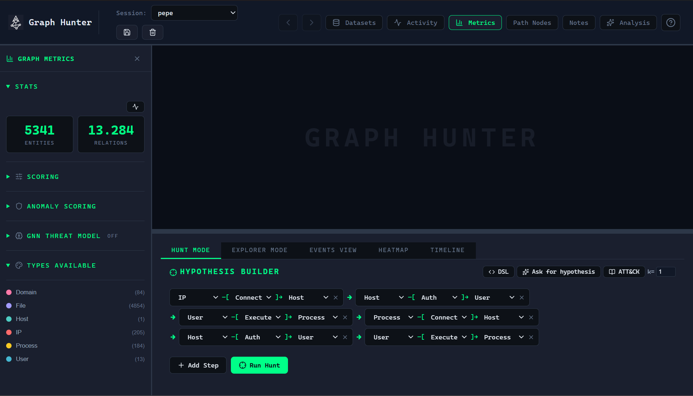
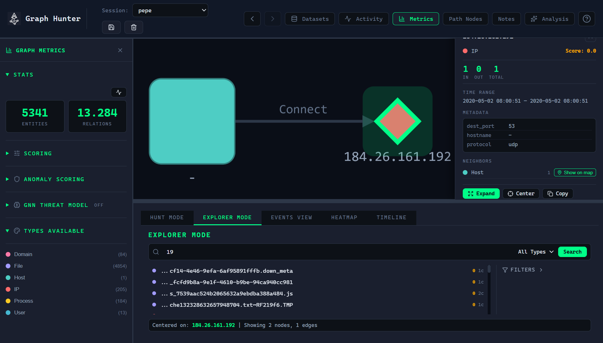
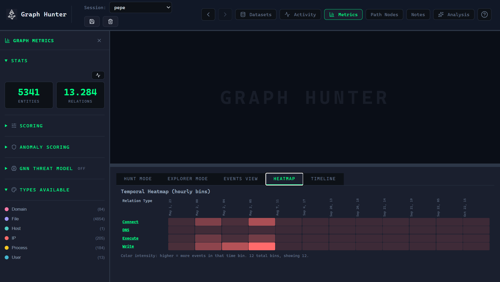
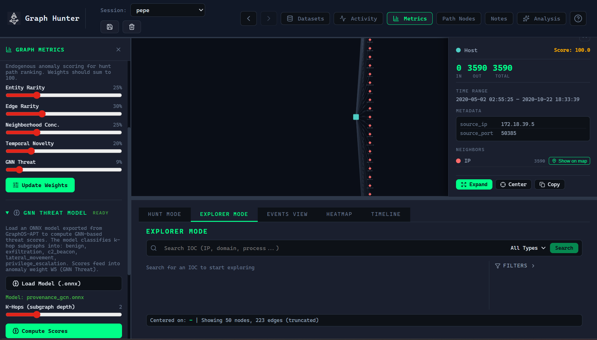

<p align="center">
	<a href="https://graphhunter.readthedocs.io/en/latest/" rel="noopener">
	 	
	</a>
</p>

<p align="center">
  <i>Graph-based & Hypothesis-driven threat hunting</i>
</p>

<p align="center">
  Ingest security logs, build an entity-relationship graph with causal ordering, and hunt for attack paths using pattern matching with optional MITRE ATT&CK–aligned detection templates. Integrates GNN-based threat classification via ONNX models with optional NPU/GPU acceleration.
</p>

<div align="center">

[](https://www.rust-lang.org/)
[](https://v2.tauri.app/)
[](https://react.dev/)
[](LICENSE)

</div>

---

## Table of Contents

- [About](#about)
- [Why Graph-Based Hunting?](#why-graph-based-hunting)
- [How It Works](#how-it-works)
- [Key Features](#key-features)
- [Supported Log Formats](#supported-log-formats)
- [SIEM Integrations](#siem-integrations)
- [Hypothesis DSL & ATT&CK Catalog](#hypothesis-dsl--attack-catalog)
- [GNN Threat Scoring](#gnn-threat-scoring)
- [Architecture](#architecture)
- [HTTP API & MCP (AI integration)](#http-api--mcp-ai-integration)
- [Installation](#installation)
- [Usage](#usage)
- [Demo Data & Try It](#demo-data--try-it)
- [Privacy & Data](#privacy--data)
- [Screenshots](#screenshots)
- [Core Engine Details](#core-engine-details)
- [Changelog](CHANGELOG.md)
- [Contributing](CONTRIBUTING.md)
- [License](#license)

---

## About

Graph Hunter is a **graph-based threat hunting engine** that turns heterogeneous security telemetry (Sysmon, Microsoft Sentinel, generic JSON, CSV) into a single **knowledge graph**. Analysts define **hypotheses** as chains of entity types and relation types (e.g., *User →[Auth]→ Host →[Execute]→ Process*). The engine finds all paths that match the pattern while enforcing **causal monotonicity**: each step occurs at or after the previous one in time. Results are explored via an interactive graph canvas, IOC search, timeline and heatmap views, and optional ATT&CK-mapped hypothesis templates.

The engine includes an **endogenous anomaly scoring system** with five components — Entity Rarity, Edge Rarity, Neighborhood Concentration, Temporal Novelty, and **GNN Threat** — that automatically prioritizes the most suspicious paths. The GNN component integrates ONNX models (e.g., exported from GraphOS-APT) that classify k-hop subgraphs into threat categories (Benign, Exfiltration, C2 Beacon, Lateral Movement, Privilege Escalation), with optional **NPU/GPU acceleration** via DirectML.



*Screenshot: Exploring nodes on map*

---

## Why Graph-Based Hunting?

Traditional SIEM-style queries are rigid and schema-bound. Attack chains span multiple data sources and event types; correlating them often requires custom rules and manual pivoting. Graph Hunter instead:

- **Normalizes** diverse log formats into a unified model (entities + typed relations + timestamps).
- **Searches** by *pattern* (who executed what, who connected where, what wrote which file) instead of by field names.
- **Surfaces** multi-hop attack paths that satisfy temporal order, so you see full chains, not isolated events.

---

## How It Works

```
Security Logs ──► Parser ──► Knowledge Graph ──► Hypothesis Search ──► Hunt Attack Paths
```

1. **Ingest** — Load logs in any supported format. The engine auto-detects the format or you can specify it. Parsers extract entities (IP, Host, User, Process, File, Domain, Registry, URL, Service) and relations (Auth, Connect, Execute, Read, Write, DNS, Modify, Spawn, Delete) with timestamps.
2. **Build Graph** — Entities become nodes, relations become directed edges. Duplicate entities are deduplicated; metadata is merged.
3. **Hunt** — Define a hypothesis as a chain of typed steps (e.g., `User →[Auth]→ Host →[Execute]→ Process`). The engine finds all paths matching the pattern with **causal monotonicity** (each step at or after the previous one). Optional **k-simplicity** allows a vertex to repeat up to *k* times per path.
4. **Explore** — Search for IOCs, expand node neighborhoods, inspect metadata and anomaly scores, pivot via Events view, Heatmap, and Timeline.



*Screenshot: Ingesting data*

---

## Key Features

| Area | Features |
|------|----------|
| **Engine** | Temporal pattern matching (DFS + causal monotonicity), 5-component endogenous anomaly scoring (ER, EdgeR, NC, TN, GNN Threat), parallel parsing (Rayon), entity/relation deduplication |
| **GNN Scoring** | ONNX model inference for k-hop subgraph classification (5 threat classes), DirectML NPU/GPU acceleration, batch scoring, configurable k-hop depth, feature-gated (`ml-scoring`) |
| **Formats** | Sysmon, EVTX, Microsoft Sentinel, generic JSON (80+ field variants), CSV; |
| **Hypotheses** | Visual step builder or **DSL** (`User -[Auth]-> Host -[Execute]-> Process`); wildcards (`*`) for any type; **ATT&CK hypothesis catalog** with one-click load |
| **UI** | **Sessions** (multiple graphs, persisted); **Hunt** vs **Explorer** modes; **Events**, **Heatmap**, **Timeline** views; **Path Nodes** (pinned nodes); **Notes** (standalone or node-linked); **GNN Threat Model** panel; paginated hunt results for large path sets |
| **Data** | Configurable generic parser (field → entity type mapping); preview before ingest; dataset list per session (remove/rename) |
| **SIEM integrations** | **Azure Sentinel** (Log Analytics): KQL queries, workspace + tenant/client/secret (env or UI). **Elasticsearch**: index + query JSON, API key or user/password (env or UI). Query-based ingest via gateway or CLI; results loaded into the graph. |

---

## Supported Log Formats

Graph Hunter supports **Sysmon**, **Microsoft Sentinel**, **generic JSON** (80+ field variants), and **CSV**. Use **Auto-detect** to let the engine choose the parser from content heuristics, or select a format manually.

**Full details** (event IDs, Sentinel tables, triples, generic field mapping, CSV): [Supported log formats](https://graphhunter.readthedocs.io/en/latest/user-guide/log-formats.html) in the documentation.

---

## SIEM Integrations

Graph Hunter can pull data directly from **Azure Sentinel** (Log Analytics) and **Elasticsearch** via their APIs—run a query, then ingest the results into your session.

| SIEM | Auth | Usage |
|------|------|--------|
| **Azure Sentinel** | Tenant ID, Client ID, Client Secret (env or UI) | Workspace ID + KQL query; default: SecurityEvent, last 24h |
| **Elasticsearch** | API key or User/Password (env or UI) | Cluster URL, index, query JSON, size |

Available in the **web app with gateway** (Datasets → Data Ingestion) or via the gateway API (`POST /api/ingest/query`). Desktop app without gateway: use **From file** and export from your SIEM first. See **[SIEM query-based ingest](https://graphhunter.readthedocs.io/en/latest/user-guide/siem-ingest.html)** in the docs for env vars and pagination.

---

## Hypothesis DSL & ATT&CK Catalog

**DSL** — Build hypotheses as arrow chains with optional wildcards:

```text
User -[Auth]-> Host -[Execute]-> Process
Process -[DNS]-> Domain -[Connect]-> IP
* -[Execute]-> Process -[Spawn]-> Process
```

**Catalog** — Pre-built hypotheses mapped to MITRE ATT&CK (e.g., Valid Accounts T1078, Credential Dumping T1003, RDP Lateral Movement T1021.001, C2 T1071). Load from the catalog or use them as templates for custom chains.

---

## GNN Threat Scoring

Graph Hunter can use **GNN-based threat classification** via ONNX models (e.g. from GraphOS-APT): the engine extracts k-hop subgraphs, runs inference (DirectML/GPU or CPU), and injects a 5-class threat score (Benign, Exfiltration, C2 Beacon, Lateral Movement, Privilege Escalation) into the anomaly scorer as weight **W5**. Hunt results are then ranked by the composite score so high-threat paths appear first. GNN scoring is optional and off by default; load a model and click **Compute Scores** in the GNN Threat Model panel to enable it.

**Full details** (pipeline, threat classes, UI workflow, training): [GNN Threat Scoring](https://graphhunter.readthedocs.io/en/latest/user-guide/gnn-threat-scoring.html) in the documentation.

---

## Architecture

Graph Hunter is split into a **Rust core** (domain logic, parsing, graph, search), a **Tauri + React** desktop app (UI and persistence), and optional **graph-hunter-mcp** for AI assistants. The core holds all business logic; the app exposes commands, session state, and an HTTP API.

**Full details** (directory layout, core modules, app structure, data flow): [Architecture](https://graphhunter.readthedocs.io/en/latest/reference/architecture.html) in the documentation.

---

## Installation

You need Rust, Node.js, and the [Tauri v2 prerequisites](https://v2.tauri.app/start/prerequisites/)—no extra services or accounts. Follow the steps below; the first run may take a few minutes while dependencies build.

1. **Install prerequisites (if not already installed):**

   - [Rust](https://rustup.rs/) (2024 edition)
   - [Node.js](https://nodejs.org/) (v18+)
   - Platform-specific build tools: see [Tauri prerequisites](https://v2.tauri.app/start/prerequisites/)

2. **Clone and run in development:**

   ```bash
   cd app
   npm install
   npm run tauri dev
   ```

3. **Verify:** The app window opens. Create a session, load `demo_data/apt_attack_simulation.json` with **Auto-detect**, then run a hunt (e.g. **Hunt Mode** → add step `User -[Auth]-> Host` → Run). If you see paths and the graph, you’re ready to go.

**Run tests:**

```bash
cd graph_hunter_core
cargo test
```

**Build for production:**

```bash
cd app
npm run tauri build
```

---

## Usage

Minimal run: start the app, load a log file, and hunt.

```bash
cd app && npm run tauri dev
```

Then in the UI: create or select a session → **Select Log File** → choose a file from `demo_data/` (or your own) → **Auto-detect** → load. Switch to **Hunt Mode**, build a hypothesis (or pick one from the ATT&CK catalog), and click **Run**. Results appear in the graph and in the hunt table when there are many paths.


*Screenshot: main window with session loaded and hunt results (add `docs/images/screenshot-main.png`).*

---

## Demo Data & Try It

Three attack simulation datasets are included in `demo_data/`:

| File | Format | Scenario |
|------|--------|----------|
| `apt_attack_simulation.json` | Sysmon | APT kill chain: spearphishing, discovery, Mimikatz, PsExec, C2, exfiltration |
| `sentinel_attack_simulation.json` | Sentinel | Cloud-to-on-prem: brute-force DC, Azure AD abuse, lateral movement, beacon, exfiltration |
| `generic_csv_logs.csv` | CSV | Firewall/proxy logs: normal + C2, SMB lateral, exfiltration attempts |

**Quick run:**

1. Start the app: `npm run tauri dev` (from `app/`).
2. Create or select a session; choose **Auto-detect** (or a specific format), then load a demo file.
3. Open **Hunt Mode** and build a hypothesis, e.g.:
   - `User →[Execute]→ Process →[Write]→ File` (malware drop)
   - `User →[Auth]→ Host` (lateral auth)
   - `Host →[Connect]→ IP` (C2)
   - `Process →[Spawn]→ Process` (parent-child chains)
   - Or pick a pattern from the **ATT&CK catalog**.
4. Switch to **Explorer Mode** to search IOCs and expand neighborhoods; use **Events**, **Heatmap**, and **Timeline** for context.

<details>
<summary>Real-world datasets (OTRF/Mordor, Splunk attack_data)</summary>

For large-scale testing with real attack telemetry, see [demo_data/DOWNLOAD_REAL_DATA.md](demo_data/DOWNLOAD_REAL_DATA.md) for download and conversion instructions (OTRF Security-Datasets, Mordor, Splunk attack_data).

</details>

---

## Privacy & data

All processing is **local**. Logs are read from files you select; no data is sent to external services. Sessions and notes are stored in your OS application data directory. No telemetry or analytics are included.

---

## Screenshots

| Description | Placeholder |
|-------------|-------------|
| **Hunt mode** — Hypothesis builder, DSL, and hunt results with graph and path table |  |
| **Explorer + graph** — IOC search, neighborhood expansion, and graph canvas |  |
| **Hypothesis & ATT&CK catalog** — Step builder and one-click catalog templates |  |
| **Events, Heatmap, Timeline** — Event list, entity/relation heatmap, temporal view |  |
| **GNN Threat Model** — ONNX model load, k-hop config, Compute Scores (optional) |  |

*Add the actual image files under `docs/images/` (e.g. `screenshot-hunt.png`, `screenshot-explorer.png`, etc.) or replace with a short [demo video](docs/images/) link.*

---

## Core Engine Details

The engine provides temporal pattern matching (DFS with causal monotonicity), time-window filtering, 5-component endogenous anomaly scoring (optional GNN), k-simplicity for path constraints, parallel parsing (Rayon), and entity/relation deduplication. Entity and relation types, and full module descriptions, are in the documentation.

**Full details:** [Architecture](https://graphhunter.readthedocs.io/en/latest/reference/architecture.html) (core modules and data flow); [Hypothesis & catalog](https://graphhunter.readthedocs.io/en/latest/user-guide/hypothesis-and-catalog.html) (DSL, k-simplicity); [Log formats](https://graphhunter.readthedocs.io/en/latest/user-guide/log-formats.html) (entity and relation types).

---

## HTTP API & MCP (AI integration)

When the desktop app is running with a session loaded, it exposes an **HTTP API** on **127.0.0.1:37891** (configurable via `GRAPHHUNTER_API_PORT`). This allows external tools to query the graph (entity types, search, expand nodes, run hunts, create notes) without using the UI. The API is protected by **token authentication**: at startup the app prints `GRAPHHUNTER_API_TOKEN=<uuid>` to the console; clients (e.g. the MCP server) must send this token (e.g. via `Authorization: Bearer <token>` or the `GRAPHHUNTER_API_TOKEN` env var) or requests return **401 Unauthorized**.

The **graph-hunter-mcp** package is an **MCP (Model Context Protocol) server** that turns these operations into tools for AI assistants (e.g. Claude Code). You can ask the AI to hunt for malicious paths, expand nodes, or summarize findings while the app holds the session and graph.

| Prerequisite | Description |
|--------------|-------------|
| App running | Start the Tauri app and load or create a session with data. |
| API token | Copy `GRAPHHUNTER_API_TOKEN` from the app startup log into your MCP config `env` so the MCP can authenticate. |
| MCP config | Add the `graph-hunter-mcp` server to your MCP client pointing at the app’s API URL. |

**Quick setup:** See **[graph-hunter-mcp/README.md](graph-hunter-mcp/README.md)** for install, `mcp.json` example, tool list, and troubleshooting (firewall, port, 401, session required).

---

## License

This project is licensed under the GNU General Public License v3.0 — see the [LICENSE](LICENSE) file for details.
