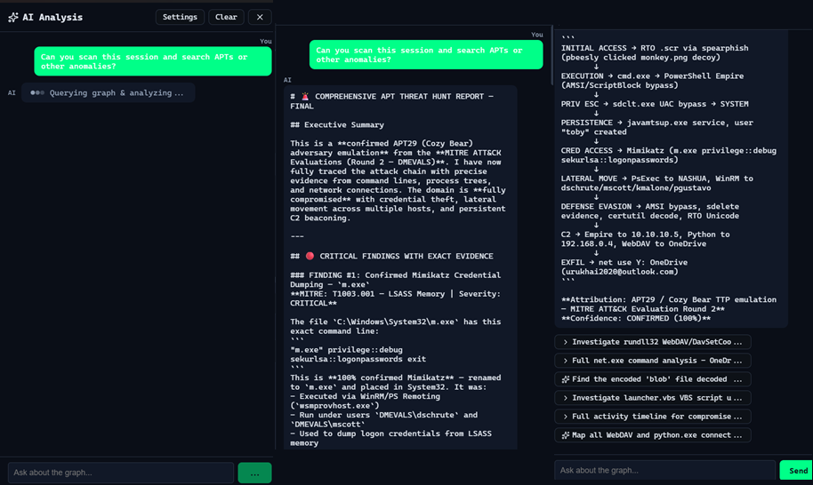

************************
HTTP API & MCP (AI integration)
************************

.. contents:: Table of Contents

When the Graph Hunter desktop app is running with a **session loaded**, it exposes an **HTTP API** on **127.0.0.1:37891** by default. The port can be changed with the ``GRAPHHUNTER_API_PORT`` environment variable. This API allows external tools to query the current session’s graph (entity types, search, expand nodes, run hunts, create notes) without using the UI. The API is protected by **token authentication**: at startup the app prints ``GRAPHHUNTER_API_TOKEN=<uuid>`` to the console; clients (e.g. the MCP server) must send this token or requests return **401 Unauthorized**.

The **graph-hunter-mcp** package is an **MCP (Model Context Protocol) server** that exposes these operations as **tools** for AI assistants (e.g. Cursor, Claude Code). You can ask the AI to hunt for malicious or suspicious paths, expand nodes, or add notes while the app holds the session and graph.

Prerequisites
=============

1. **Graph Hunter desktop app** must be running with a session loaded and data ingested (non-empty graph).
2. The app must be reachable at the API URL (default ``http://127.0.0.1:37891``). Use ``GRAPHHUNTER_API_URL`` in the MCP config if you use a different host/port.
3. **API token**: The app prints ``GRAPHHUNTER_API_TOKEN=<uuid>`` when it starts. Copy that value into your MCP server config (e.g. ``env.GRAPHHUNTER_API_TOKEN``) so the MCP can authenticate; otherwise API calls return 401 Unauthorized.

Install and build (MCP server)
=============================

.. code-block:: bash

   cd graph-hunter-mcp
   npm install
   npm run build

Cursor setup
============

1. Start **Graph Hunter** (Tauri app), create or load a session, and load some data so the graph is non-empty.
2. Add the MCP server to Cursor: open **Cursor Settings → MCP** (or ``.cursor/mcp.json`` in your project).
3. Add a server entry that runs the built MCP process via stdio.

Example **mcp.json** (path to ``graph-hunter-mcp`` can be absolute or relative to the project that uses it). Set ``GRAPHHUNTER_API_TOKEN`` to the value printed by the app at startup (required; otherwise you get 401 Unauthorized):

.. code-block:: json

   {
     "mcpServers": {
       "graph-hunter": {
         "command": "node",
         "args": ["C:/path/to/GraphHunter/graph-hunter-mcp/dist/index.js"],
         "env": {
           "GRAPHHUNTER_API_URL": "http://127.0.0.1:37891",
           "GRAPHHUNTER_API_TOKEN": "<paste token from app startup>"
         }
       }
     }
   }

4. Restart Cursor or reload MCP so it connects to the server.

MCP tools
=========

| Tool | Description |
|------|-------------|
| ``get_entity_types`` | List entity types in the graph (IP, Host, User, Process, etc.). |
| ``search_entities`` | Search entities by substring; optional type filter and limit. |
| ``expand_node`` | Expand from a node to get neighbors (nodes + edges). |
| ``get_node_details`` | Get details for one node (scores, degrees, neighbor counts). |
| ``get_subgraph`` | Get nodes and edges for a list of node IDs. |
| ``get_events_for_node`` | Get all relations/events for a node. |
| ``run_hunt`` | Run a hypothesis in DSL form (e.g. ``IP -[Connect]-> Host -[Execute]-> Process``); returns path count. When anomaly scoring is enabled, uses score-guided search. |
| ``get_hunt_results`` | Get one page of the last hunt results with scores (structural always; anomaly and GNN threat when scoring is enabled). Query params: ``page``, ``page_size``, optional ``min_score``. |
| ``create_note`` | Add a note to the current session (e.g. hunt report); optional ``node_id`` to link to a graph node. |

Use these tools from Cursor (or any MCP client) to explore the graph and look for malicious or suspicious paths. Ensure Graph Hunter is running and a session with data is loaded before calling the tools.

**Scoring:** The HTTP API exposes ``GET /hunt_results`` (page, page_size, min_score) for paginated scored paths. When anomaly scoring is enabled in the app, ``run_hunt`` uses score-guided search and ``get_hunt_results`` returns ``anomaly_score`` and ``anomaly_breakdown`` (including ``gnn_threat``). When scoring is off, paths still include structural scores (max_score, total_score).

Troubleshooting
===============

- **401 Unauthorized** — The API requires a token. Copy ``GRAPHHUNTER_API_TOKEN`` from the app startup log into your MCP server ``env``; the app prints it when it starts.
- **Tools return "Aborted" or no result** — The MCP server is connected, but calls go to the Graph Hunter app over HTTP. Check: (1) App is running, (2) A session is loaded, (3) Data has been ingested, (4) API is reachable and token is set (e.g. ``curl -H "Authorization: Bearer <token>" http://127.0.0.1:37891/entity_types`` returns JSON).
- **Connection refused** — App not running, or wrong port/URL. Set ``GRAPHHUNTER_API_PORT`` for the app and ``GRAPHHUNTER_API_URL`` for the MCP server to match.
- **Windows Firewall** — If the app logs "HTTP API listening" but connections fail, allow the app (e.g. ``graph-hunter-app.exe``) in Windows Defender Firewall for Private networks, or keep the API bound to 127.0.0.1 only (default).
- **HTML instead of JSON** — Another service may be using the port; stop it so only Graph Hunter uses 37891. Prefer ``127.0.0.1`` over ``localhost`` in ``GRAPHHUNTER_API_URL`` on Windows.

For more detail and checklist, see **graph-hunter-mcp/README.md** in the repository.
