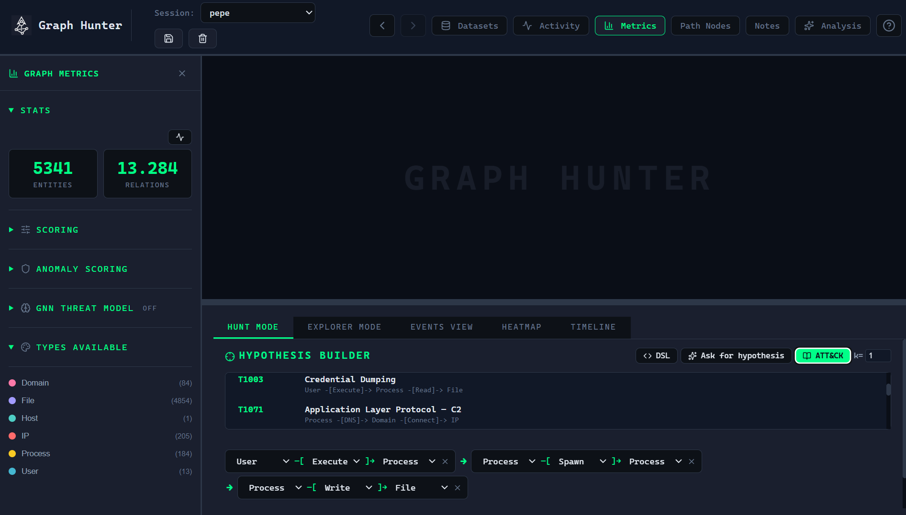

****************************************
Hypothesis DSL & ATT&CK catalog
****************************************

.. contents:: Table of Contents

You can define hunt hypotheses with the **visual step builder** or the **DSL** (arrow-chain syntax). The **ATT&CK catalog** provides pre-built patterns mapped to MITRE ATT&CK techniques.

Hypothesis DSL
===============

Syntax: chains of the form ``EntityType -[RelationType]-> EntityType ...``.

Entity types
------------

``IP``, ``Host``, ``User``, ``Process``, ``File``, ``Domain``, ``Registry``, ``URL``, ``Service``, or ``*`` (wildcard: any entity type).

Relation types
---------------

``Auth``, ``Connect``, ``Execute``, ``Read``, ``Write``, ``DNS``, ``Modify``, ``Spawn``, ``Delete``, or ``*`` (wildcard: any relation type).

Examples
--------

.. code-block:: text

   User -[Auth]-> Host -[Execute]-> Process
   Process -[DNS]-> Domain -[Connect]-> IP
   * -[Execute]-> Process -[Spawn]-> Process
   User -[*]-> *

* **Wildcards** (``*``) match any entity or relation type at that step.
* The engine finds all paths that match the chain with **causal monotonicity**: each step occurs at or after the previous one in time.
* Optional **k-simplicity** (e.g. ``{k=2}``) allows a vertex to appear up to *k* times in a path (default is 1, i.e. simple paths).

In the UI
---------

* In **Hunt Mode**, type a chain in the DSL input and use **Parse** (or equivalent) to load it as the current hypothesis.
* The formatted hypothesis is shown; you can then set a time window and **Run**.

ATT&CK hypothesis catalog
==========================

The catalog includes pre-built hypotheses mapped to MITRE ATT&CK. Examples:

.. list-table::
   :header-rows: 1
   :widths: 28 12 60

   * - Name
     - MITRE ID
     - Pattern (DSL)
   * - Valid Accounts — Lateral Auth
     - T1078
     - ``User -[Auth]-> Host -[Execute]-> Process``
   * - PowerShell Execution
     - T1059.001
     - ``User -[Execute]-> Process -[Spawn]-> Process -[Write]-> File``
   * - RDP Lateral Movement
     - T1021.001
     - ``IP -[Connect]-> Host -[Auth]-> User -[Execute]-> Process``
   * - Credential Dumping
     - T1003
     - ``User -[Execute]-> Process -[Read]-> File``
   * - Application Layer Protocol — C2
     - T1071
     - ``Process -[DNS]-> Domain -[Connect]-> IP``

In the app, open the catalog from Hunt Mode and **load** a hypothesis with one click; you can then run it as-is or edit steps and run.

Time window
===========

When running a hunt, you can restrict the search to a **time range** (start and end timestamps). Only relations within that window are considered, so you can focus on a specific phase of an attack or reduce noise.
